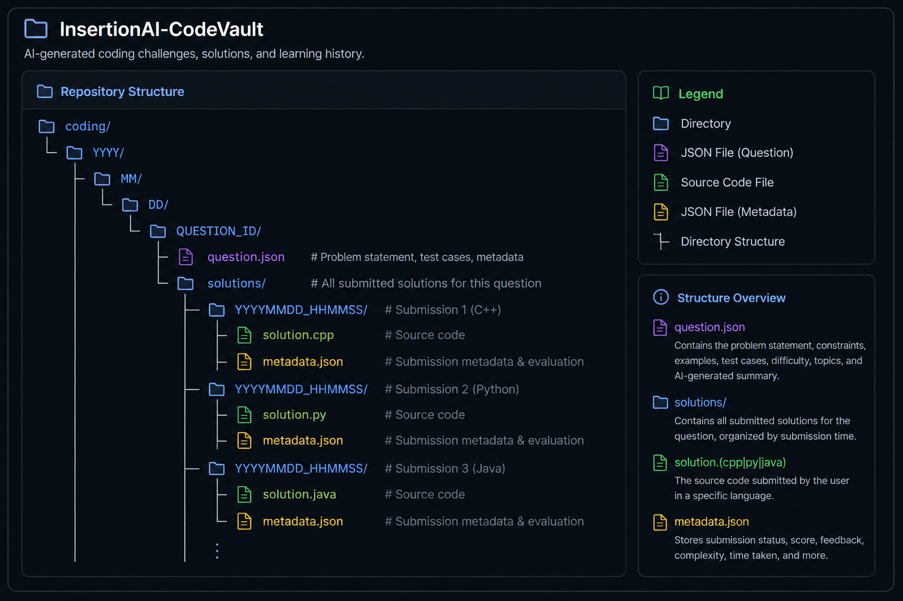

## InsertionAI_CodeVault

### AI-generated coding challenges, solutions, and learning history powering InsertionAI.

#

#### A structured repository that stores AI-generated programming problems, complete solution history, metadata, and progress analytics for continuous interview preparation.

- 🤖 Generated and managed automatically by **InsertionAI**
- 🧩 Stores AI-generated coding challenges with public and hidden test cases
- 💻 Archives every submitted solution in **Python**, **C++**, and **Java**
- 📈 Tracks solving history, completion status, difficulty, and performance
- 🧠 Maintains metadata for learning analytics and future question generation
- ⚠️ This repository is intended to be managed by InsertionAI and is not designed for manual editing.

#

**Repository Activity**

  

#

**Repository Structure**

  

#

> This repository serves as the persistent coding knowledge base for **InsertionAI**, enabling adaptive question generation, progress tracking, and long-term interview preparation.
